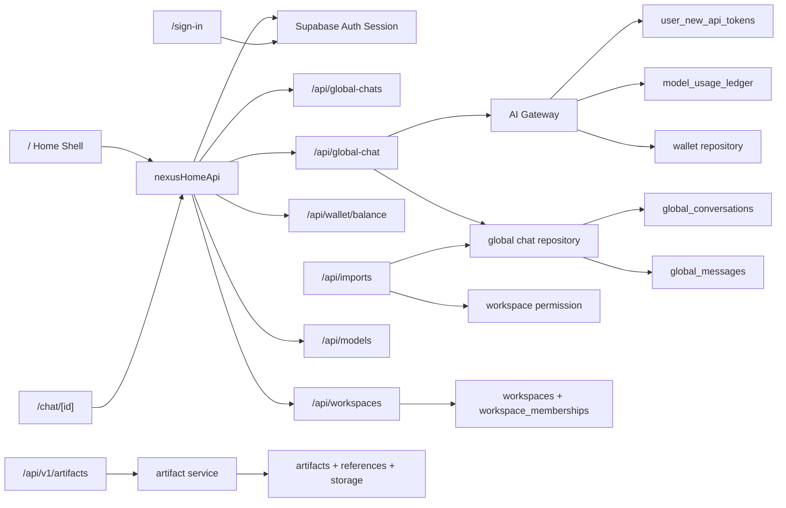

# Current System Logic Map

## Evidence-Grounded Flow

## Route Ownership

| Surface | Route | Current role | Evidence |
|---|---|---|---|
| Home shell | `/` | Platform entry + API adapter consumer | `src/app/page.tsx:14`, `src/components/nexus-home/NexusHomeShell.tsx:22` |
| Identity | `/sign-in` | Supabase Auth entry | `src/app/sign-in/page.tsx:18` |
| Chat detail | `/chat/[id]` | Message continuation line | `src/app/chat/[id]/page.tsx:25` |
| Workspace OS | `/workspace/[id]` | Mature workspace surface host | `src/app/workspace/[id]/page.tsx:20` |
| Wallet | `/wallet` | Thin socket for wallet line | `src/app/wallet/page.tsx:12` |
| Workspaces | `/workspaces` | Thin socket for workspace line | `src/app/workspaces/page.tsx:11` |
| Artifacts | `/artifacts` | Thin socket for artifact line | `src/app/artifacts/page.tsx:11` |
| Search | `/search` | Thin socket for retrieval line | `src/app/search/page.tsx:11` |
| Workflows | `/workflows` | Thin socket for orchestration line | `src/app/workflows/page.tsx:11` |

## Shared API Boundary

`apiHandler` is the strongest current backend foundation for v1 routes. It centralizes method validation, JSON parsing, workspace id resolution, actor resolution, permission checks, idempotency, success/failure envelope, and backend event emission.

Evidence:

- Actor and workspace resolution: `src/lib/backend/api/api-handler.ts:83` to `src/lib/backend/api/api-handler.ts:112`
- Permission gate: `src/lib/backend/api/api-handler.ts:114` to `src/lib/backend/api/api-handler.ts:151`
- Idempotency: `src/lib/backend/api/api-handler.ts:153` to `src/lib/backend/api/api-handler.ts:197`
- Envelope and events: `src/lib/backend/api/api-handler.ts:199` to `src/lib/backend/api/api-handler.ts:252`

Inference:

Future core routes should prefer `apiHandler` where possible. Legacy/simple routes such as `/api/global-chat`, `/api/global-chats`, `/api/wallet/balance`, `/api/workspaces`, `/api/imports`, and `/api/user/token-status` currently hand-roll error response handling. This is not automatically wrong, but it is a core environment alignment candidate.

## Supabase Connection Classes

| Client class | File | Role | Notes |
|---|---|---|---|
| Browser client | `src/lib/supabase/client.ts` | Frontend auth/session and runtime public config | Build-time env or `/api/v1/public-config` fallback |
| Admin client | `src/lib/supabase/admin.ts` | Server service-role repository access | Requires `SUPABASE_SERVICE_ROLE_KEY` |
| Request client | `src/lib/supabase/request.ts` | Request-scoped RLS client with user bearer | Used by workspace permission fallback |
| Auth verifier client | `src/lib/backend/security/auth-session.ts` | Server token verification with anon key | Reads Bearer/cookie access token |

## Data Spine Gap

Evidence:

- Migrations define `global_conversations` and `global_messages`: `supabase/migrations/20260621002313_create_global_chat_tables.sql:11` and `supabase/migrations/20260621002313_create_global_chat_tables.sql:38`.
- Migrations define `wallet_transactions` and `wallet_balances`: `supabase/migrations/20260620181653_create_wallet_tables.sql:11` and `supabase/migrations/20260620181653_create_wallet_tables.sql:49`.
- Migrations define `user_new_api_tokens`: `supabase/migrations/20260610002000_user_new_api_tokens.sql:3`.
- `src/lib/supabase/database.types.ts:760` to `src/lib/supabase/database.types.ts:828` lists many public tables, but not the above three domains.
- Code therefore uses `as never` for newer tables in `src/app/api/user/token-status/route.ts:38`, `src/lib/backend/new-api-token/user-new-api-token-service.ts:36`, `src/lib/backend/models/global-chat-repository.ts:170`, and `src/lib/backend/models/wallet-repository.ts:208`.

Inference:

This is the highest leverage infrastructure alignment gap. New core work should not pile more route logic on top of typed-table drift.

## Large File Responsibility Inventory

### `src/store/nexus-store.ts` - 4679 lines

Responsibilities observed by symbol scan:

- IndexedDB/local persistence setup and migration keys.
- Auth vault normalization and safe local persistence.
- Artifact vault cache and transient generated artifact records.
- Workspace creation, switching, cloud sync queueing.
- Historical message cache and debounced fetch.
- Notebook/prompt cache refresh.
- Workflow runtime lite graph/node/group state.
- Tool execution and runtime trace sync state.

Future boundary suggestion: split into workspace persistence, auth vault, artifact vault, workflow runtime state, and cache refresh modules before future core adds more foundation state.

### `src/components/nexus/nexus-ops.tsx` - 3684 lines

Responsibilities observed by symbol scan:

- Workspace shell orchestration.
- Store selectors/actions for agents, workspaces, graph, workflow runtime, artifacts, notebooks, prompts, auth vault.
- Workspace theme/style preview/import/export.
- Macro/workflow contract import/export.
- Artifact hydration and cloud fetch.
- Workspace session recovery after login.

Future boundary suggestion: treat as mature workspace surface host and dependency consumer. Phase 6 should map its seams rather than use it as the default place for new core.

### `src/components/nexus/nexus-graph.tsx` - 2409 lines

Responsibilities observed by symbol scan:

- React Flow agent graph and runtime graph rendering.
- Runtime node editors for input/model/file/image nodes.
- Workflow brain side panel and draft generation.
- Generated asset menu and runtime status display.

Future boundary suggestion: Workflow line should isolate graph editing, runtime node forms, and brain proposal review before becoming a platform-level core.

### `src/components/nexus/workflow-pro/workflow-pro-surface.tsx` - 1721 lines

Responsibilities observed by symbol scan:

- Workflow Pro mode shell.
- Contract import/paste review.
- Evidence gate summaries.
- Proposal review queue.
- Brain proposal intake.
- File pipeline/capability registry.

Future boundary suggestion: This is a workflow core candidate, but global `/workflows` route should wait for contract and ownership alignment.

