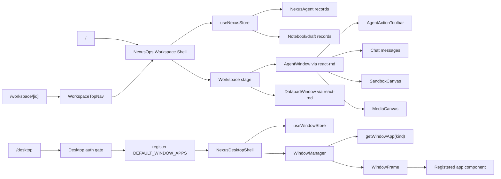

# R1 Current System Logic Map

## High-Level Flow

## Workspace Floating Runtime Today

### Opening and rendering

Workspace does not open generic app windows. It renders known workspace units directly:

- `NexusOps` selects `viewMode` from the store in `src/components/nexus/nexus-ops.tsx:1126-1130`.
- In `panels` mode it maps `visibleAgents` to `AgentWindow` in `src/components/nexus/nexus-ops.tsx:3426-3458`.
- It separately maps `openNotebookIds` to `DatapadWindow` in `src/components/nexus/nexus-ops.tsx:3600-3604`.
- It mounts `WorkspaceChatComposerShell`, `RightFloatingDock`, `CommandPalette`, macro modal, and prompt vault manager from the shell in `src/components/nexus/nexus-ops.tsx:3607-3661`.

### Window state and focus

- Agent creation assigns initial window layout with position, size, and z-index in `src/store/nexus-store.ts:2106-2132`.
- `focusAgent` raises z-index and selects/activates the agent in `src/store/nexus-store.ts:2590-2611`.
- `updateLayout` updates the agent layout and clears maximized state in `src/store/nexus-store.ts:2625-2639`.
- `minimizeAgent`, `restoreAgent`, `toggleMaximizeAgent`, `minimizeAll`, `restoreAll`, and `arrangeAgents` live in `src/store/nexus-store.ts:3474-3579`.
- Workspace bounds are measured once in `NexusOps` with `ResizeObserver`, window resize, and an interval in `src/components/nexus/nexus-ops.tsx:1881-1918`.

### Drag and resize

- `AgentWindow` uses `react-rnd` with `bounds="parent"` and `dragHandleClassName="nexus-drag-handle"` in `src/components/nexus/nexus-agent-window.tsx:536-542`.
- Drag stop writes `{ x, y }` through `onUpdateLayout` in `src/components/nexus/nexus-agent-window.tsx:502-507`.
- Resize stop writes width, height, and position through `onUpdateLayout` in `src/components/nexus/nexus-agent-window.tsx:509-519`.
- `DatapadWindow` also uses `react-rnd`, but only with a default frame and a separate notebook layer z-index in `src/components/nexus/DatapadWindow.tsx:13-36` and `src/components/nexus/DatapadWindow.tsx:84-96`.

### Toolbar actions

Workspace agent window chrome is partly generic and partly feature-specific:

- `AgentWindow` renders `AgentActionToolbar` and passes close, duplicate, minimize, maximize, branch, vault, sandbox save, sandbox editor, and sandbox lock callbacks in `src/components/nexus/nexus-agent-window.tsx:604-633`.
- `AgentActionToolbar` defines sandbox-only controls, optional open/download/copy handlers, branch, clear, duplicate, maximize, minimize, stop, and close buttons in `src/components/nexus/nexus-chrome.tsx:130-290`.
- `MinimizedRail` restores minimized agents in `src/components/nexus/nexus-chrome.tsx:296-331`.

## `/desktop` Window Runtime Today

### Opening and rendering

- `/desktop` registers `DEFAULT_WINDOW_APPS` through `registerWindowApp` in `src/app/desktop/page.tsx:111-130`.
- `NexusDesktopShell` launches a window by looking up `getWindowApp(kind)` and calling `openWindow` with metadata from the definition in `src/kernel/window/NexusDesktopShell.tsx:159-179`.
- `WindowManager` reads `windows` from `useWindowStore`, looks up the app definition, and renders the app component inside `WindowFrame` in `src/kernel/window/WindowManager.tsx:128-193`.

### State and persistence

- `NexusWindowKernelSnapshot` serializes windows, layout, minimized/maximized, max z-index, focus, and save time in `src/kernel/window/window-types.ts:64-86`.
- `window-store` writes that snapshot to localStorage under `nexus-window-os:v1` in `src/kernel/window/window-store.ts:40-91`.
- Mutations are debounced for 300ms in `src/kernel/window/window-store.ts:202-217`.
- `openWindow` handles singleton reuse/focus and creates new generic `NexusWindow` records in `src/kernel/window/window-store.ts:238-322`.

### Drag, resize, focus, toolbar

- `WindowFrame` focuses on click/mousedown and delegates focus to `focusWindow` in `src/kernel/window/WindowFrame.tsx:46-64` and `src/kernel/window/WindowFrame.tsx:197-198`.
- Drag uses document `mousemove`/`mouseup` handlers and `moveWindow` in `src/kernel/window/WindowFrame.tsx:68-98`.
- Resize uses a bottom-right handle and `resizeWindow` in `src/kernel/window/WindowFrame.tsx:100-135` and `src/kernel/window/WindowFrame.tsx:252-263`.
- Title-bar controls close, minimize, and maximize/restore through the window store in `src/kernel/window/WindowFrame.tsx:137-165` and `src/kernel/window/WindowFrame.tsx:206-236`.
- Taskbar launcher and minimized-window restore live in `src/kernel/window/NexusDesktopShell.tsx:381-455`.

## Difference Map

| Axis | Workspace current | `/desktop` current | Migration note |
|---|---|---|---|
| Runtime unit | `NexusAgent` / notebook window | `NexusWindow` | Workspace apps need a generic window instance shape before registry bridge |
| Content selection | Hardcoded render branches in `NexusOps` and capability checks in `AgentWindow` | Registry `kind -> component` | R3 should introduce registry bridge into Workspace |
| State owner | `nexus-store` mixed domain + UI state | `window-store` pure kernel | Shared runtime needs persistence adapter |
| Drag/resize library | `react-rnd` | manual mouse events | Choose one for shared runtime or wrap both behind frame adapter |
| Focus | `focusAgent` mutates agent z-index and selection | `focusWindow` mutates window z-index and focused id | Same conceptual behavior |
| Maximize restore | Agent keeps `previousLayout` | `NexusWindow` does not store previous layout | Desktop restore currently cannot recover pre-maximize layout from type/store alone |
| Minimize surface | `MinimizedRail` inside workspace stage | taskbar minimized items | Runtime lifecycle can be shared; UI host differs |
| Bounds | Workspace stage bounds from `NexusOps` | desktop viewport minus taskbar | Shared runtime should accept host bounds |
| Persistence | Zustand persist to IndexedDB with partialized workspace state | localStorage snapshot | Must be pluggable |
| Shell UI | TopBar, left dock, right dock, bottom composer, command palette | taskbar, launcher, desktop palette, notification center | Shell affordances should remain host-specific |
| Capability metadata | Mostly not used for Workspace windows | app definitions carry capabilities/archetype/lifecycle | Keep metadata read-only |

## R2 Boundary Inputs

These are inputs for the next packet, not implemented architecture:

1. Define a shared vocabulary for `floating window instance` that can cover `NexusAgent` and `NexusWindow` without forcing immediate data migration.
2. Define host adapters for bounds, persistence, focus/z-index, and shell UI.
3. Decide whether shared frame drag/resize should use `react-rnd` or the existing manual `WindowFrame` handlers.
4. Preserve Workspace visual language from `AgentWindow` and shell stage while borrowing `/desktop` registry and slot mechanics.
5. Treat sandbox migration separately: first register a Workspace sandbox app wrapper, then later extract sandbox content out of agent-only assumptions.
6. Keep `/desktop` as staging/POC until Workspace can open at least one registry app without shell-specific rendering.

## Risks

1. Workspace god file risk: adding app registry rendering directly into `NexusOps` without extracting host/runtime boundaries will increase the 3684-line shell.
2. Two-runtimes risk: leaving `AgentWindow` runtime and `/desktop` runtime permanently separate will duplicate drag/resize/focus/layout behavior.
3. Restore regression risk: `/desktop` maximize currently overwrites layout without a previous layout field; copying that behavior into Workspace would regress the safer agent restore model.
4. Persistence mismatch risk: Workspace uses IndexedDB/Zustand persistence, while `/desktop` uses localStorage snapshots.
5. Registry overreach risk: capability metadata must remain metadata; it should not decide runtime permission or automatically assemble products.
6. Sandbox coupling risk: Sandbox UI is coupled to `NexusAgent`; migrating it as a generic app will require a context adapter.
