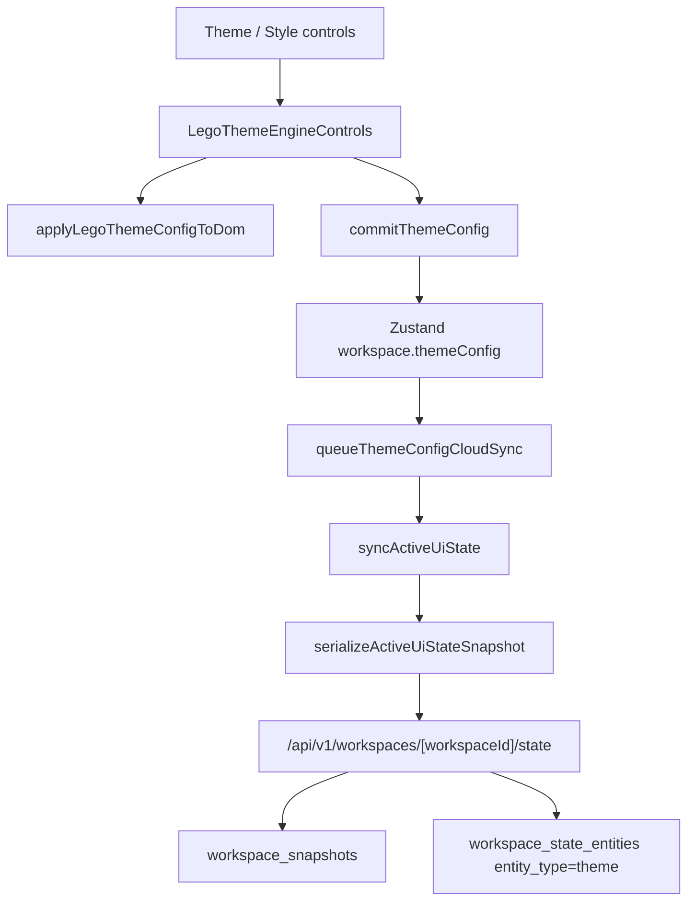
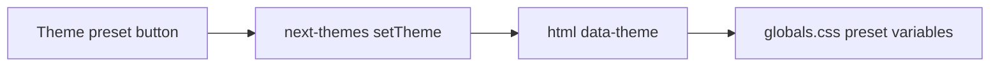
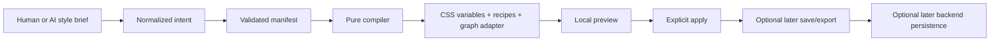

# NEXUS Style Engine Total Upgrade Master Plan

Generated on 2026-05-29 for the current `FreeChat` workspace.

This document converts the current low-friction V1 blueprint and the larger
`nexusstyle總升級.md` reference into a current-state aligned total upgrade plan.
It is intentionally written as a buildable engineering map, not as a visual
dream board.

## 0. Scope Lock

This pass is documentation-only.

No production code, database schema, Supabase data, Vercel settings, GitHub
branch, package dependency, internal store, or runtime behavior should be
changed as part of this document pack.

Allowed output:

- Markdown planning files.
- Future prompts and execution checklists.
- Architecture maps, risk gates, and verification loops.

Disallowed output:

- Editing `src/**`, `supabase/**`, `package.json`, `next.config.ts`, or tests.
- Creating Supabase migrations.
- Creating or mutating live Supabase data.
- Deploying to Vercel.
- Rewriting UI classes.
- Creating feature flags in runtime code.

## 1. Executive Decision

The upgrade direction is correct, but the execution must be narrower and more
guarded than the original concept text implies.

The current app is not locked into a dead CSS skin. It already has the right
early organs for a style engine:

- CSS variables in `src/app/globals.css`.
- `data-theme` presets through `next-themes`.
- Tailwind v4 variable bridge in `tailwind.config.ts` and `@theme inline`.
- Theme controls in `src/components/nexus/nexus-ops.tsx`.
- A typed `WorkspaceThemeConfig`.
- Existing workspace sync and Supabase projection behavior.

The dangerous part is that the existing theme controls are not just local
visual state. `workspace.themeConfig` already flows into active workspace state,
local persistence, sync payloads, and Supabase projection entities. Therefore
the total upgrade must treat preview style, applied preference, saved style pack,
and backend persistence as four different states.

Minimum-friction direction:

1. Preserve the current app and baseline surface-shell baseline.
2. Create a style contract before touching components.
3. Build a pure manifest validator and compiler before runtime preview.
4. Keep preview local-only until explicit persistence contracts exist.
5. Migrate primitives in small units, with behavior ledgers and rollback gates.
6. Put React Flow behind an adapter instead of letting global CSS or manifest
   fields touch graph internals directly.
7. Add Supabase persistence only after a separate style-pack model, RLS policy,
   branch verification, and migration review exist.

## 2. Inputs Used

Local reference documents:

- `/Users/sean/Documents/FreeChat/NEXUS_STYLE_ENGINE_V1_LOW_FRICTION_UPGRADE.md`
- `/Users/sean/Downloads/nexusstyle總升級.md`

Current repo anchors:

- Branch: `v16-a-sync-recovery-preview`
- Package: Next `16.2.6`, React `19.2.6`, Tailwind `4`, Supabase JS `2.106.1`,
  React Flow `@xyflow/react` `12.10.2`, Zustand `5.0.13`.
- Scripts: `npm run lint`, `npm run typecheck`, `npm run test`,
  `npm run build`, `npm run check`.
- `next.config.ts` currently has no custom deployment/runtime config.
- Current git status has many modified and untracked V16 sync/backend files.

External docs consulted:

- Supabase docs on Next.js Auth, API keys, RLS, and service role boundaries.
- Vercel docs on environment variables, preview deployment, build logs, and
  rollback/debug loops.
- GitHub integration expectations were treated as PR/CI/review boundaries only;
  no GitHub mutation was needed for this documentation pass.

## 3. Current Architecture Reality

### 3.1 Style Foundation

Current style foundation lives mostly in:

- `src/app/globals.css`
- `tailwind.config.ts`
- `src/components/theme-provider.tsx`
- `src/components/nexus/nexus-ops.tsx`
- `src/components/nexus/nexus-graph.tsx`
- `src/components/nexus/DatapadWindow.tsx`
- `src/components/nexus/PromptVaultManager.tsx`
- `src/components/nexus/auth-screen.tsx`

The current foundation is useful but mixed:

| Layer | Current State | Upgrade Meaning |
| --- | --- | --- |
| Theme presets | `data-theme="surface-shell/apple/tesla/terminal"` | Keep as legacy preset registry and bridge. |
| CSS variables | `--bg-base`, `--panel-bg`, `--theme-primary`, shadows, radius, blur | Promote into semantic token registry. |
| Tailwind bridge | Tailwind maps to CSS variables | Keep Tailwind structural; do not generate runtime classes from manifest. |
| LEGO theme controls | DOM variable patching plus committed `themeConfig` | Split preview from applied durable config. |
| Component classes | Many visual classes remain in TSX | Classify before replacing; do not mass-clean. |
| React Flow | Global CSS plus component styling | Move to adapter contract gradually. |

### 3.2 Current Theme Data Flow

Current durable theme flow:



Current preset flow:



These are separate flows today. A future Style Engine must not accidentally
merge them.

### 3.3 Current Backend and Supabase Reality

Current repo already contains a workspace state/sync backend direction:

- `workspace_snapshots`
- `workspace_state_entities`
- `entity_type='theme'`
- security and RLS migrations in `supabase/migrations/**`
- environment checks for `NEXT_PUBLIC_SUPABASE_URL`,
  `NEXT_PUBLIC_SUPABASE_ANON_KEY`, and server-only `SUPABASE_SERVICE_ROLE_KEY`

Important boundary:

`themeConfig` is currently durable active UI state. It is not safe as a dumping
ground for generated style manifests, preview drafts, raw CSS, or imported style
documents.

Current issue to preserve in the backlog:

- `glowIntensity` exists in UI/type/theme defaults, but the current
  `sanitizeThemeConfig()` path does not preserve it. Any durable theme guarantee
  should treat this as a blocker before promising complete persistence.

### 3.4 Dirty Worktree Constraint

The branch contains many modified and untracked V16 files. A style-engine
upgrade must not assume a clean baseline.

Rule:

Before any implementation work, create a checkpoint document or branch strategy
that records:

- current branch name
- current commit
- modified files
- untracked files
- files owned by the style-engine task
- files that must be ignored because they belong to V16 sync/backend work

No implementation prompt should ask Codex to "clean up", "reset", or "normalize"
the repo.

## 4. What The Original Prompt Missed

The original direction is strong, but it did not fully lock the execution
boundaries. These gaps are likely to cause upgrade failures.

### 4.1 Missing State Vocabulary

The prompt needs four separate state meanings:

| State | Meaning | Allowed Storage in Early Versions |
| --- | --- | --- |
| Preview | temporary visual experiment | component-local/runtime-only |
| Apply | current runtime visual choice | provider/runtime state; limited existing config only when explicit |
| Save | named user style pack | later style-pack model, not V1-V4 |
| Persist | durable backend/account/workspace storage | only after V13 persistence contract |

Without this vocabulary, Codex may put preview into `workspace.themeConfig`,
which would trigger sync and cloud writes.

### 4.2 Missing Source-of-Truth Hierarchy

Needed hierarchy:

1. Style Contract defines semantic slots.
2. Manifest describes intent in validated data.
3. Compiler maps manifest to CSS variables, recipes, and adapters.
4. Runtime provider injects compiled output.
5. Components consume semantic variables/primitives only.
6. Backend persists only approved style-pack or preference models later.

Components should never import raw manifest or parse style documents.

### 4.3 Missing Dirty-Repo Gate

Current repo has broad V16 sync/backend changes. The prompt needs a gate that
forces the agent to distinguish:

- existing user/work-in-progress changes
- style-engine documentation files
- future style-engine implementation files
- unrelated backend/sync changes

### 4.4 Missing Supabase Persistence Gate

The original concept says "save, share, marketplace", but early versions must
not create tables or routes. Supabase work needs:

- branch or disposable project first
- RLS enabled and reviewed
- no service role exposure to frontend
- `getUser()`-based protected server validation where user identity matters
- migration and generated types review
- advisors/security checks
- Data API exposure review for any new table/API route surface

### 4.5 Missing Vercel Preview Gate

Style Engine changes can pass local typecheck but fail in production-like
builds. Add:

- local `npm run check`
- Vercel preview deployment only after local pass
- preview URL smoke test
- build log/error log review
- production deploy blocked until preview passes

### 4.6 Missing GitHub/PR Review Gate

Future implementation should produce a reviewable PR sequence:

- one version per PR or small migration unit
- changed-file ownership table
- verification checklist in PR body
- screenshots for UI-affecting changes
- rollback notes
- no bundled unrelated V16 sync/backend changes

### 4.7 Missing Browser Visual/Interaction Verification

The prompt asks for architecture but not enough runtime proof. Future versions
need browser verification for:

- initial load
- theme switch
- panel/window layout
- drag/resize
- modal overlay and z-index
- scroll containment
- React Flow pan/zoom/select/drag
- auth screen
- prompt vault/datapad workflows

### 4.8 Missing Failure Triage Loop

The plan needs a standard loop when something breaks:

1. Identify whether failure is visual, layout, behavior, sync, backend, build,
   or deployment.
2. Check whether the touched file was allowed for that version.
3. Check whether preview leaked into workspace/sync.
4. Revert only the current migration unit, not unrelated user changes.
5. Update the ledger with the failed assumption.

## 5. Closed Loops To Add

### 5.1 Scan Loop

Run before every version:

1. Repo status scan.
2. Style surface scan.
3. Class taxonomy scan.
4. Data-flow scan.
5. Protected behavior scan.
6. External docs scan when Supabase, Vercel, GitHub, or Next.js behavior is
   involved.
7. Output a short "allowed touch / forbidden touch" table.

Pass condition:

- The version has an explicit file boundary.
- Preview/apply/save/persist meaning is stated.
- Sync/backend impact is stated.

### 5.2 Execution Loop

Use for every implementation unit:

1. Select one migration target.
2. State intent and forbidden areas.
3. Implement the smallest change.
4. Run static checks.
5. Run focused tests.
6. Run browser smoke when UI changes.
7. Check sync/backend pollution.
8. Update ledger.
9. Decide PASS, HOLD, FAIL, or ROLLBACK.

### 5.3 Review Loop

Every version must end with:

- changed files
- changed contracts
- changed runtime behavior
- untouched protected behaviors
- known risks
- test commands and result
- manual browser checks and result
- rollback path

### 5.4 Verification Loop

Base verification:

```bash
npm run lint
npm run typecheck
npm run test
npm run build
```

Repo-level shortcut:

```bash
npm run check
```

UI versions add:

- desktop browser smoke
- narrow/mobile viewport smoke
- no console error check
- React Flow interaction smoke
- drag/resize smoke
- modal/z-index smoke

Backend/Supabase versions add:

- migration diff review
- generated TypeScript types review
- RLS policy review
- advisor/security check
- API route auth check
- service role boundary check

Vercel versions add:

- preview deployment
- build logs review
- preview error logs review
- affected route smoke
- production deployment hold until preview pass

### 5.5 Rollback Loop

Rollback triggers:

- preview enters `workspace.themeConfig` unintentionally
- preview triggers sync
- component imports manifest directly
- manifest allows raw CSS or JS
- runtime manifest generates Tailwind classes
- drag/resize/pointer-events/z-index behavior regresses
- React Flow pan/zoom/select breaks
- auth or Supabase route behavior changes outside version scope
- Vercel preview build fails after local pass

Rollback rule:

Revert only the current migration unit. Do not revert unrelated dirty worktree
changes.

## 6. Protected Boundary Ledger

### 6.1 Files To Treat As Critical

| File / Area | Risk | Early-Version Rule |
| --- | --- | --- |
| `src/store/nexus-store.ts` | workspace state and sync queue | V1-V4 read-only unless explicit implementation gate says otherwise. |
| `src/lib/state-sync.ts` | Supabase sync bridge | No preview state. No style sync operation in V1-V12. |
| `src/lib/workspace-kernel.ts` | sanitize/hydrate/import/export | Read-only in early docs/audit; note `glowIntensity` drift. |
| `src/lib/backend/**` | server contracts, auth, persistence | No style persistence until V13. |
| `supabase/migrations/**` | live schema risk | No migrations until persistence contract and branch verification. |
| `src/components/nexus/nexus-ops.tsx` | huge app shell/client hub | Avoid broad rewrite; use extraction/mapping only after contract. |
| `src/components/nexus/nexus-graph.tsx` | React Flow behavior | Visual adapter only; do not mutate graph behavior selectors freely. |
| `src/app/globals.css` | global visual system | Additive token bridge only after contract; avoid deleting global hooks. |
| `tailwind.config.ts` | build-time token bridge | No runtime class generation. |

### 6.2 Classes And Styles Taxonomy

| Class Type | Example Meaning | Can Be Tokenized? | Guardrail |
| --- | --- | --- | --- |
| Pure visual | color, border color, shadow, opacity | Yes | Map to semantic tokens. |
| Layout | flex/grid/width/height/inset/overflow | Sometimes | Only after layout contract. |
| Behavior | drag handle, pointer events, select, resize | No by default | Protected ledger required. |
| Third-party adapter | React Flow class selectors | Only through adapter | Do not let manifest touch internals directly. |
| State-linked | active, selected, disabled, loading, error | Yes through state recipes | Preserve state semantics. |
| Persistence-linked | workspace/theme/sync classes or controls | Not visual-only | Requires data-flow review. |

## 7. Total Upgrade Version Ladder

### Phase 0: Documentation And Baseline Lock

#### V0 - Baseline Freeze And Ownership Map

Goal:

Establish exact current state and ownership before any implementation.

Deliverables:

- repo status checkpoint
- dirty worktree map
- current style/sync/backend architecture map
- allowed/forbidden file table
- first visual behavior ledger

Allowed:

- Markdown docs only.

Forbidden:

- code edits
- Supabase migrations
- Vercel deploy
- branch reset or cleanup

Gate:

- The next implementation prompt can point to one stable document pack.

### Phase 1: Foundation Contract

#### V1 - Style Surface Audit

Goal:

Classify all style-affecting surfaces into visual, layout, behavior,
third-party, state-linked, and persistence-linked.

Deliverables:

- `docs/style-system/style-surface-audit.md`
- hardcoded visual token inventory
- React Flow style inventory
- protected behavior ledger
- theme data-flow map

Allowed:

- docs
- optional read-only scripts if explicitly requested

Forbidden:

- changing classes
- creating primitives
- changing store/sync/backend

Gate:

- Each high-risk component has a visual slot map and a no-touch behavior list.

#### V2 - Style Contract And Semantic Token Registry

Goal:

Define the semantic language components will eventually consume.

Core contract groups:

- `surface.app`
- `surface.panel`
- `surface.overlay`
- `surface.raised`
- `text.primary`
- `text.secondary`
- `text.muted`
- `accent.primary`
- `accent.secondary`
- `border.subtle`
- `border.focus`
- `shadow.panel`
- `window.chrome`
- `dock.item`
- `modal.backdrop`
- `input.surface`
- `graph.node`
- `graph.edge`
- `status.success/warning/error/info`

Deliverables:

- contract spec doc
- token naming rules
- CSS variable naming rules
- legacy variable mapping
- deprecation model for old tokens

Allowed:

- docs
- pure type/interface draft only in a later implementation pass

Forbidden:

- runtime provider
- component migration
- backend persistence

Gate:

- Contract can express current surface-shell style and at least one non-surface-shell
  style without adding component-specific color names.

#### V3 - Manifest Schema And Safety Validator

Goal:

Define `NexusStyleManifestV1` as data-only, safe, versioned style intent.

Manifest must support:

- identity and version
- intent metadata
- foundation tokens
- semantic tokens
- density
- radius
- motion
- typography
- surface hierarchy
- component recipes
- graph adapter tokens
- validation warnings

Manifest must forbid:

- raw JS
- raw arbitrary CSS
- workspace state
- sync state
- backend route config
- auth config
- arbitrary z-index
- arbitrary pointer-events
- runtime Tailwind class generation

Deliverables:

- manifest spec
- validator rules
- valid examples: `baseline-surface-shell`, `soft-os`
- invalid examples and error reasons

Gate:

- Invalid manifests fail safely before compile or preview.

#### V4 - Pure Compiler

Goal:

Compile validated manifest into deterministic output without DOM, workspace, or
backend side effects.

Output groups:

- CSS variable map
- component recipe variable map
- React Flow adapter config
- preview report
- warnings

Allowed:

- pure functions in a future implementation pass
- unit tests

Forbidden:

- DOM writes
- provider state
- `workspace.themeConfig`
- Supabase

Gate:

- Same manifest produces same compiled output.
- Compiler cannot output raw unbounded CSS or runtime Tailwind classes.

### Phase 2: Runtime Preview Without Persistence

#### V5 - Local-Only Runtime Preview

Goal:

Create a preview boundary that can apply compiled variables locally and revert.

State rule:

Preview state is local/runtime-only. It does not enter:

- `workspace.themeConfig`
- `nexus-store.ts`
- IndexedDB workspace persistence
- `state-sync.ts`
- Supabase

Deliverables:

- preview/apply/revert contract
- runtime provider location decision
- smoke checklist

Gate:

- Preview can be enabled, changed, reverted, and disabled without sync.

#### V6 - Legacy Bridge

Goal:

Map the existing CSS variable and `data-theme` system into Style Engine output.

Deliverables:

- `baseline-surface-shell` manifest
- mapping from current CSS variables to semantic tokens
- compatibility notes for apple/tesla/terminal presets

Allowed:

- additive bridge only

Forbidden:

- deleting existing presets
- forcing all components into primitives

Gate:

- Baseline surface-shell can be represented without visual collapse.

#### V7 - Primitive Specimens

Goal:

Create the first primitive layer as specimens, not a full app rewrite.

Recommended primitives:

- `NexusPanel`
- `NexusButton`
- `NexusInput`
- `NexusWindow`
- `NexusModal`

Migration target:

- Isolated preview surfaces first.
- Then one low-risk production component.

Gate:

- Primitive states work: default, hover, focus, active, disabled, loading,
  selected, destructive/error.
- Keyboard focus remains visible.

### Phase 3: Component Migration Units

#### V8 - App Shell Semantic Mapping

Goal:

Map TopBar, docks, panel shells, workspace background, and navigation surfaces
to semantic slots.

Forbidden:

- changing workspace functional state
- changing sync queue behavior
- moving app shell state ownership

Gate:

- Shell still loads, theme preset still works, no layout jump at desktop and
  narrow widths.

#### V9 - Window And Modal Recipe System

Goal:

Move window chrome, modal shell, backdrop, focus ring, and overlay depth into
recipes.

Protected behavior:

- drag handle
- resize handle
- window stacking
- pointer-events
- modal focus/close
- scroll containment

Gate:

- Drag/resize works.
- Modal overlays correctly.
- No global z-index regression.

#### V10 - React Flow Adapter V1

Goal:

Move graph visual language into an adapter.

Adapter controls:

- node fill/stroke/text
- selected/hover/active state
- edge color/width/animation style
- minimap colors
- background/grid color
- controls visual treatment

Adapter must not control:

- pan/zoom behavior
- node drag behavior
- selection behavior
- edge connection logic
- pointer-events rules unless explicitly protected

Gate:

- Pan, zoom, drag, select, connect, minimap, and controls still work.

### Phase 4: Style Lab And Generation

#### V11 - Style Lab

Goal:

Create a dedicated surface for manifest preview, comparison, validation, and
export without touching production workspace data.

Capabilities:

- manifest editor/import field
- validation report
- compiled token preview
- primitive gallery
- graph preview
- legacy vs new comparison
- local-only preview

Gate:

- Invalid manifest cannot apply.
- Closing the lab leaves workspace state unchanged unless explicit apply is
  added in a later version.

#### V12 - Style Interpreter / Normalizer

Goal:

Convert human or AI style descriptions into manifest drafts.

Rule:

AI output is draft-only. It must pass schema and safety validation before
preview.

Inputs:

- style document
- brand brief
- user language
- CSS draft as reference text only

Outputs:

- normalized intent
- manifest draft
- warnings/questions

Gate:

- No direct code execution.
- No raw CSS injection.
- No component import of manifest.

### Phase 5: Persistence, Governance, Platform

#### V13 - Persistence Contract

Goal:

Define how saved style packs and workspace style preferences become durable.

Required decisions:

- Is a saved style pack global, user-owned, workspace-owned, team-owned, or
  marketplace-owned?
- Is workspace preference a pointer to a style pack, an override patch, or both?
- How does this relate to existing `workspace.themeConfig`?
- What needs to sync in real time, if anything?

Recommended model:

- Keep `WorkspaceThemeConfig` as legacy micro-controls or compatibility patch.
- Store full style packs separately.
- Store workspace preference as a pointer plus small override.
- Never store raw unvalidated imported style docs as applied workspace state.

Supabase gate:

- branch/disposable project first
- RLS enabled before Data API exposure
- service role server-only
- generated types updated
- advisors checked
- migration rollback path documented

#### V14 - Style Pack Governance

Goal:

Make style packs versioned, validated, reviewed, and rollbackable.

Capabilities:

- manifest versioning
- compatibility matrix
- deprecated token handling
- import/export checksums
- safety review status
- upgrade/downgrade path

Gate:

- A style pack can be rejected, upgraded, downgraded, or retired without breaking
  workspaces.

#### V15 - Personalized UI Factory

Goal:

Allow user-facing or AI-assisted generation of personalized workspaces while
keeping the functional system stable.

Capabilities:

- user style brief
- AI draft
- validation
- preview
- user approval
- save/export
- marketplace-ready pack metadata later

Gate:

- Generated styles are assets, not uncontrolled code.
- Workspace logic, sync, auth, graph behavior, and backend contracts remain
  stable.

## 8. Frontend Coupling Rules

### 8.1 Component Rule

Components may consume:

- primitive props
- semantic class hooks
- CSS variables
- compiled recipe variables
- adapter config passed through controlled props

Components may not consume:

- raw manifest
- raw style document
- raw AI output
- backend persistence model
- dynamic Tailwind class strings generated from manifest

### 8.2 Tailwind Rule

Tailwind remains for:

- layout
- responsive structure
- stable utility scaffolding
- semantic variable bridge

Tailwind must not become:

- runtime style compiler
- manifest interpreter
- dynamic class string target

### 8.3 CSS Variable Rule

CSS variables become the runtime delivery vehicle. They should be organized as:

- foundation variables
- semantic variables
- component recipe variables
- adapter variables

Existing variables should be bridged, not deleted, until migration coverage is
proven.

## 9. Backend And Data Flow Rules

### 9.1 Early Versions

V1-V12:

- no new Supabase tables
- no new style persistence API
- no workspace snapshot schema changes
- no style preview sync
- no durable generated manifest in workspace state

### 9.2 Persistence Versions

V13+ only:

- style packs may become a backend model
- workspace style preference may become durable
- marketplace/sharing can be considered

Required Supabase rules:

- RLS on exposed tables.
- Use anon/publishable key only where RLS protects data.
- Never expose service role key in frontend.
- Use server-side user validation for protected writes.
- Review generated database types after migration.
- Run security/performance advisors after DDL changes.

### 9.3 Suggested Future Data Model Direction

Do not implement yet. This is a target shape for V13 discussion:

```text
style_packs
- id
- owner_user_id / team_id
- slug
- name
- manifest_version
- manifest_jsonb
- manifest_checksum
- validation_status
- created_at
- updated_at

workspace_style_preferences
- workspace_id
- style_pack_id
- override_patch_jsonb
- applied_by
- applied_at
```

This keeps full style assets away from the active workspace snapshot and allows
workspace preference to be a controlled pointer.

## 10. Vercel And Deployment Rules

Vercel is not needed for documentation-only work. Future implementation versions
should use Vercel only after local checks pass.

Deployment loop:

1. Run local checks.
2. Build locally.
3. Deploy preview.
4. Inspect build logs.
5. Smoke affected routes in preview.
6. Check preview error logs.
7. Hold production deploy until preview is clean.

Environment rule:

- Style Engine must not require new env vars before V13 persistence or AI import.
- If AI style generation later requires provider keys, keep them server-only.
- Existing Supabase env boundaries remain unchanged.

## 11. GitHub And PR Rules

Future implementation should be PR-sized:

- one phase or migration unit per branch
- no unrelated V16 sync/backend files
- PR body includes changed files, contract changes, verification, screenshots,
  rollback path
- CI must pass before moving to the next version
- review comments become new ledger entries, not hidden fixes

Recommended branch naming:

```text
codex/style-engine-v01-audit
codex/style-engine-v02-contract
codex/style-engine-v03-manifest
```

## 12. Acceptance Standard

The total upgrade is successful only when the system can do this:



And while doing it:

- workspace functional state remains stable
- sync does not receive preview noise
- Supabase is not touched until persistence contract exists
- Vercel production is not touched until preview passes
- React Flow behavior remains intact
- drag/resize/modal/scroll behavior remains intact
- components do not import manifests
- manifests do not contain raw JS or arbitrary CSS

## 13. Immediate Next Best Step

Do not start coding the full Style Engine yet.

The next implementation-grade request should ask Codex to produce a technical
document pack first:

1. `style-surface-audit.md`
2. `style-contract-v1.md`
3. `manifest-v1-spec.md`
4. `compiler-v1-contract.md`
5. `preview-apply-persist-boundary.md`
6. `protected-behavior-ledger.md`
7. `versioned-implementation-plan.md`

After that doc pack is reviewed, begin V1 audit or V2 contract implementation
as a separate branch.

## 14. Reference Links

- Supabase Next.js Auth guide: https://supabase.com/docs/guides/auth/server-side/nextjs
- Supabase API security/RLS guidance: https://supabase.com/docs/guides/api/securing-your-api
- Supabase API keys guidance: https://supabase.com/docs/guides/api/api-keys
- Vercel env CLI docs: https://vercel.com/docs/cli/env
- Vercel preview deploy docs: https://vercel.com/docs/projects/deploy-from-cli
- Vercel deployment rollback/debug docs: https://vercel.com/docs/deployments/rollback-production-deployment
- Vercel production error debugging docs: https://vercel.com/docs/observability/debug-production-errors
