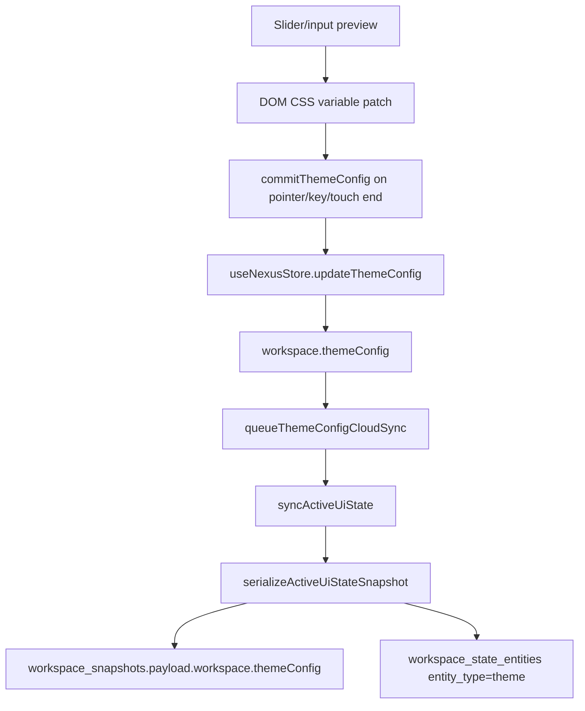
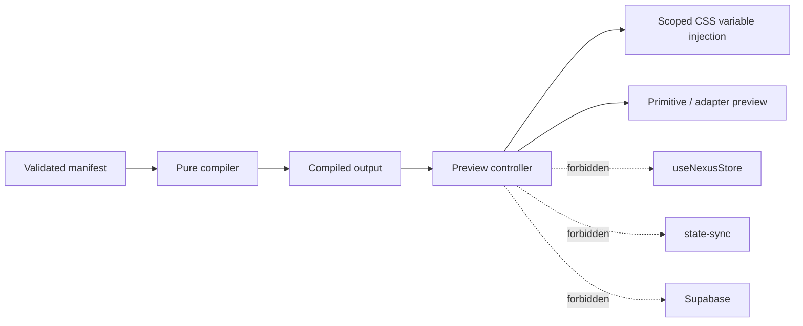

# NEXUS Style Engine Preview / Apply / Save / Persist Boundary

This document is the state contract for Style Engine work. It prevents temporary visual exploration from becoming durable workspace data.

## 0. Four State Words

| State | Meaning | Early storage | Backend allowed? | Sync allowed? |
| --- | --- | --- | --- | --- |
| Preview | Temporary local visual experiment | component-local state, isolated preview controller, DOM CSS variables that can be reverted | No | No |
| Apply | User explicitly chooses a runtime visual output | runtime provider state; limited existing `WorkspaceThemeConfig` only for current micro-controls | Not by default | Not by default |
| Save | User names or exports a style pack/preference | future local/export model after contract | V13+ only | V13+ only |
| Persist | Durable account/workspace/team storage | future Supabase/backend model | Yes, after branch/RLS/advisor gate | Yes, after explicit model |

Short rule:

```text
Preview is not Apply.
Apply is not Save.
Save is not Persist.
Persist is not allowed until V13+.
```

## 1. Why Preview Must Not Enter `workspace.themeConfig`

`workspace.themeConfig` is already durable active UI state.

Current flow:



If an AI-generated manifest, imported style document, raw CSS draft, or transient Style Lab selection enters `workspace.themeConfig`, it can:

- Persist to local workspace state.
- Enter the cloud snapshot payload.
- Create sync noise.
- Become a Supabase projection row.
- Pollute workspace restore.
- Become hard to distinguish from explicit user intent.

Therefore:

```text
Preview must live outside NexusWorkspace.
Preview must live outside ActiveUiStateSnapshot.
Preview must live outside WorkspaceCloudSnapshotPayload.
Preview must live outside workspace_state_entities.
Preview must live outside sync_operations.
```

## 2. Existing `WorkspaceThemeConfig`

Current type fields:

```text
radius
blur
borderWidth
glowIntensity
iconWeight
fontFamily
chatOpacity
```

Current important drift:

- UI/type/defaults include `glowIntensity`.
- `sanitizeThemeConfig()` does not preserve `glowIntensity`.
- Any future durable applied-theme guarantee must fix or explicitly address this drift first.

Recommended interpretation:

| Field set | Meaning |
| --- | --- |
| Current `WorkspaceThemeConfig` | Legacy micro-control compatibility patch. |
| Future `NexusStyleManifestV1` | Full validated style asset. |
| Future workspace style preference | Pointer to a validated style pack plus small override patch. |

Do not squeeze a full generated style pack into `WorkspaceThemeConfig`.

## 3. Future Runtime Boundary

Early preview architecture:



Allowed preview storage:

- React component local state.
- A dedicated non-persistent preview controller.
- A temporary `<style>` tag or DOM variable scope that can be removed.
- Browser session-only scratch only if explicitly documented and not sync-backed.

Forbidden preview storage:

- `workspace.themeConfig`.
- `NexusWorkspace`.
- `ActiveUiStateSnapshot`.
- `WorkspaceCloudSnapshotPayload`.
- IndexedDB workspace persistence.
- `state-sync.ts`.
- Supabase tables.
- `workspace_state_entities`.

## 4. Apply Boundary

Apply means the user has explicitly chosen a runtime style.

Early Apply may:

- Switch the runtime provider to a compiled style output.
- Keep legacy `data-theme` preset selection working.
- Optionally use the current small `WorkspaceThemeConfig` micro-controls only when the user is explicitly using those controls.

Early Apply must not:

- Save a full manifest to workspace state.
- Create a new sync operation.
- Persist a style pack.
- Modify Supabase schema.
- Write raw CSS or compiled CSS into snapshots.

## 5. Save And Persist Boundary

Save is an explicit user action to name or export a style asset.

Persist is backend/account/workspace/team durability.

Recommended V13+ data shape, not to implement now:

```text
style_packs
- id
- owner_user_id / team_id
- slug
- name
- manifest_version
- manifest_jsonb
- manifest_checksum
- validation_status
- created_at
- updated_at

workspace_style_preferences
- workspace_id
- style_pack_id
- override_patch_jsonb
- applied_by
- applied_at
```

Why this shape:

- Full style assets remain separate from active workspace snapshots.
- Workspace preference can be a pointer, not a raw manifest dump.
- Validation status and checksum become reviewable.
- Rollback can switch a pointer instead of rewriting workspace state.

## 6. Supabase Persistence Gate

No Supabase persistence before V13.

When V13 begins:

1. Use a disposable branch or local DB first.
2. Draft schema and RLS policy.
3. Keep RLS enabled on exposed tables.
4. Keep service role server-only.
5. Use `/api/v1` Route Handler -> service -> repository pattern.
6. Generate/review TypeScript database types.
7. Run advisors/security checks.
8. Verify Data API/schema exposure.
9. Document rollback migration or quarantine path.

Official Supabase docs/guidance checked for this boundary:

- Next.js Auth guidance: protected server data must validate with `getUser()` rather than trusting a session cookie alone.
- API key guidance: publishable/anon keys can be browser-side only with RLS; service role is server-side only and bypasses RLS.
- RLS guidance: user data in exposed schemas needs policies before frontend access.

## 7. Sync Pollution Check

Before accepting any future Style Engine UI/runtime change, run a sync pollution check:

```text
Did this change call updateThemeConfig?
Did it add fields to NexusWorkspace?
Did it add fields to ActiveUiStateSnapshot?
Did it touch serializeActiveUiStateSnapshot?
Did it touch workspace-state routes/services/repositories?
Did it enqueue via state-sync or local sync queue?
Did it change Supabase migrations or database types?
```

If any answer is yes, the change is not a local preview change. It needs a higher phase gate.
