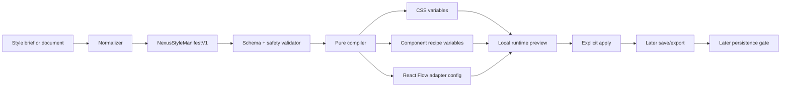
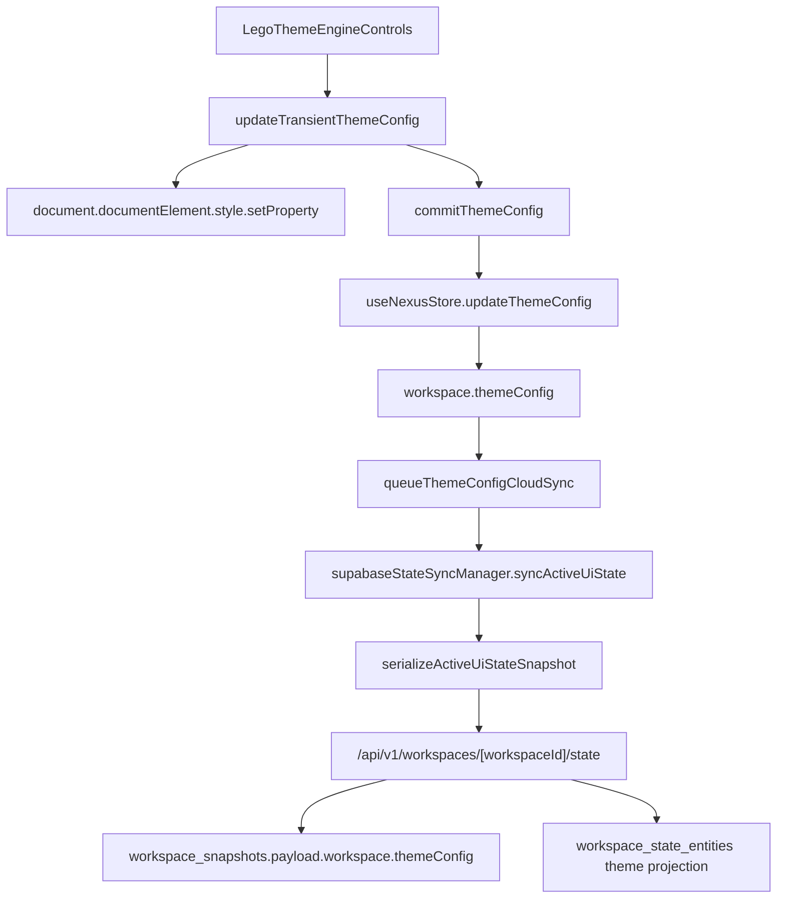
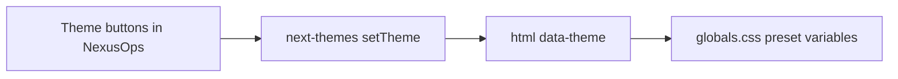

# NEXUS Style Engine Total Upgrade Master Plan

Generated on 2026-05-29 for `/Users/sean/Documents/FreeChat`.

This is the execution-grade master plan for the NEXUS Style Engine upgrade. It follows the priority order:

1. `docs/style-system/NEXUS_STYLE_ENGINE_CORRECTED_CODEX_PROMPT.md`
2. `docs/style-system/NEXUS_STYLE_ENGINE_TOTAL_UPGRADE_MASTER_PLAN.md`
3. `NEXUS_STYLE_ENGINE_V1_LOW_FRICTION_UPGRADE.md`
4. `/Users/sean/Downloads/nexusstyle總升級.md`

The fourth document is treated as long-term product ambition only. It cannot override the safety boundaries in the first three.

## 0. Scope Lock

This pass is documentation-only.

Allowed:

- Markdown technical documents in `docs/style-system/`.
- Read-only repo scans.
- Future execution prompts, ledgers, gates, and dependency policies.

Forbidden:

- Runtime code edits.
- Test edits.
- `package.json` or lockfile edits.
- Supabase migration or live database changes.
- Vercel deployment/config changes.
- Git branch, commit, PR, or GitHub mutation.
- Any broad class replacement or UI migration.

## 1. Executive Decision

The Style Engine direction is correct, but the execution must remain contract-first and state-boundary-first.

NEXUS already has a style-system embryo:

- `src/app/globals.css` defines `data-theme` presets, CSS variables, a Tailwind v4 `@theme inline` bridge, app/global hooks, and React Flow overrides.
- `src/components/theme-provider.tsx` uses `next-themes` with `attribute="data-theme"`, `defaultTheme="cyberpunk"`, and four current presets.
- `src/components/nexus/nexus-ops.tsx` contains `LEGO_THEME_DEFAULTS`, `LEGO_THEME_VARIABLES`, DOM variable patching, and committed workspace theme controls.
- `src/lib/nexus-types.ts` defines `WorkspaceThemeConfig`.
- `src/store/nexus-store.ts` persists `themeConfig` into active workspace state and queues cloud sync.
- `src/lib/backend/workspace/workspace-snapshot-serializer.ts` serializes `themeConfig`.
- `src/lib/backend/workspace/workspace-state-entity-repository.ts` projects `themeConfig` into `workspace_state_entities` as `entity_type='theme'`.

The core decision:

```text
Do not build a "theme switcher".
Build a data-safe pipeline:

Style Brief
-> Normalized Intent
-> NexusStyleManifestV1
-> Validator
-> Pure Compiler
-> CSS variables / component recipes / React Flow adapter config
-> local preview
-> explicit apply
-> later save/export
-> later persistence
```

The lowest-friction path is not to install a large design framework or rewrite `nexus-ops.tsx`. It is to preserve the current cyberpunk baseline while creating the contracts that let the frontend, backend, sync, and deployment layers talk to each other without leaking responsibilities.

## 2. Current Repo Reality

Current scan facts:

| Area | Finding | Planning consequence |
| --- | --- | --- |
| Branch | `v16-a-sync-recovery-preview` at `b3561cf` | Treat current worktree as WIP; do not mix style implementation with V16 sync/recovery changes. |
| Worktree | Many modified and untracked V16/backend/sync files | Future Style Engine work needs a checkpoint or separate branch before code changes. |
| Next.js | `next@16.2.6`, App Router | Read `node_modules/next/dist/docs/` before any Next implementation claims. |
| React | `react@19.2.6` | Keep client boundaries small; avoid making more of the app client-only. |
| Tailwind | Tailwind v4 via `@tailwindcss/postcss` and `@theme inline` | Use CSS variables as runtime delivery, not runtime-generated Tailwind classes. |
| State | Zustand + IndexedDB/localStorage persistence | Preview state must not enter the core store. |
| Graph | `@xyflow/react@12.10.2` | React Flow styling must be adapter-managed. |
| Windowing | `react-rnd@10.5.3` | Drag/resize/z-index are protected behavior, not visual tokens. |
| Supabase | `@supabase/supabase-js@2.106.1`, migrations present | Persistence is V13+ only and requires branch/RLS/advisor gates. |
| Vercel | `next.config.ts` has no custom config, no `vercel.json` found | Vercel is a future verification gate, not needed for docs-only work. |
| GitHub | No `.github` workflow files found in this scan | GitHub is a PR/CI/review gate; do not assume CI coverage exists. |

Next.js local docs checked:

- `node_modules/next/dist/docs/01-app/01-getting-started/11-css.md`
- `node_modules/next/dist/docs/01-app/01-getting-started/05-server-and-client-components.md`
- `node_modules/next/dist/docs/01-app/01-getting-started/15-route-handlers.md`
- `node_modules/next/dist/docs/01-app/01-getting-started/03-layouts-and-pages.md`

Relevant local doc implications:

- Global CSS is imported through the root layout, which matches the current `src/app/layout.tsx`.
- Client behavior belongs in Client Components; `NexusOps` and the current theme provider are client-side surfaces.
- App Router Route Handlers live under `app/**/route.ts` and are the correct API surface for future backend persistence gates.

## 3. Architecture Map

Target source-of-truth hierarchy:

```text
Style Contract
-> Manifest Schema
-> Safety Validator
-> Pure Compiler
-> Runtime compiled output
-> Provider / preview controller
-> Primitives / recipes / adapters
-> optional persistence model
```

Runtime ownership rule:

| Layer | Owns | Must not own |
| --- | --- | --- |
| Style brief | Human or AI intent | Runtime CSS, JS, workspace state |
| Manifest | Data-only style contract | Component internals, sync state, auth config |
| Validator | Safety and schema acceptance | UI mutation |
| Compiler | Deterministic CSS variable and adapter output | DOM writes, store writes, Supabase writes |
| Runtime provider | Local injection and preview/apply state | Durable persistence in early versions |
| Components | Semantic variables, primitives, adapter props | Raw manifest parsing |
| Backend | Saved packs/preferences only after V13 | Preview drafts or compiled CSS dumps |

System flow:



## 4. Frontend / Function / Backend Coupling Map

Current theme config durable flow:



Current preset flow:



These two flows must stay separate until an explicit Apply/Persist contract exists.

High-signal coupling facts:

- `WorkspaceThemeConfig` has `radius`, `blur`, `borderWidth`, `glowIntensity`, `iconWeight`, `fontFamily`, and `chatOpacity`.
- `sanitizeThemeConfig()` currently preserves `radius`, `blur`, `borderWidth`, `iconWeight`, `fontFamily`, and `chatOpacity`, but not `glowIntensity`.
- `borderWidth` is effectively pinned to default in `normalizeThemeConfig()` / DOM application.
- `src/app/globals.css` already redirects many legacy Tailwind color families through CSS variables; this is Legacy Bridge V0.
- `src/components/nexus/nexus-graph.tsx` mixes hardcoded visual values with React Flow behavior handlers; graph migration must go through adapter.

## 5. Risk Map

| Risk | Why it matters | Master rule |
| --- | --- | --- |
| Preview enters `workspace.themeConfig` | It will be persisted, serialized, synced, and projected to Supabase | Preview is runtime/local-only. |
| AI manifest becomes raw CSS/JS | Unsafe, hard to validate, impossible to rollback cleanly | Manifest is data-only. |
| Runtime manifest generates Tailwind classes | Tailwind is build-time; runtime classes will miss CSS or require large safelists | Compiler outputs CSS variables, not class strings. |
| `nexus-ops.tsx` broad rewrite | App shell, auth, windows, dock, sync, theme controls are coupled | Only map first; migrate one unit later. |
| React Flow treated as normal CSS | Pan/zoom/drag/select/handles are fragile | Use adapter config and behavior ledger. |
| Drag/resize/z-index tokenized | These are functional interaction contracts | Never free-control through manifest. |
| Supabase persistence too early | Schema/RLS becomes premature product debt | No new tables/routes until V13 persistence gate. |
| Vercel skipped for UI-affecting versions | Local success may not match production-like build/runtime | Preview deploy only after local checks pass. |
| GitHub PR bundles unrelated V16 files | Review and rollback become unclear | One migration unit per branch/PR. |

## 6. What The Prompt Still Needed

The corrected prompt already fixes most failure modes. The repo scan adds these extra closures:

- `glowIntensity` sanitizer drift must be a named blocker before durable applied theme guarantees.
- `themeOptions` in `nexus-ops.tsx` duplicates the preset list in `theme-provider.tsx`; future contract needs a single registry.
- Current CSS includes external placeholder asset URLs in theme variables; future imported style packs need an asset policy before allowing external assets.
- There is no `.github` workflow evidence in this scan; do not write GitHub CI gates as if they already exist.
- Vercel is not configured through `vercel.json`; Vercel gates should be command/process gates, not repo-config claims.
- Current `/api/v1` routes use `apiHandler`, permission checks, idempotency, and `runtime = "nodejs"` patterns; future style persistence should follow this route/service/repository pattern.

## 7. Closed Loops

### Scan Loop

Run before every future phase:

1. `git status --short`, branch, commit.
2. Read phase docs and this master plan.
3. Scan allowed/forbidden files.
4. Classify touched classes as visual, layout, behavior, adapter, state-linked, or persistence-linked.
5. Map data flow from UI to store/API/backend/Supabase.
6. Read local Next docs if touching App Router, CSS, route handlers, or client/server boundaries.
7. Use Supabase/Vercel/GitHub docs/connectors only for gates; no live mutation unless explicitly requested.

### Execution Loop

1. Select one migration unit.
2. State allowed and forbidden files.
3. Implement the smallest change.
4. Run focused checks.
5. Browser-smoke UI changes.
6. Check no sync/workspace/backend pollution.
7. Update ledger.
8. Decide `PASS`, `HOLD`, `FAIL`, or `ROLLBACK REQUIRED`.

### Review Loop

Every future implementation result must report:

- Changed files.
- Intentionally untouched protected files.
- Contract changes.
- Runtime behavior changes.
- Sync/backend impact.
- Protected behavior audit result.
- Verification commands and result.
- Browser checks and result.
- Rollback path.

### Verification Loop

Base local gate:

```bash
npm run lint
npm run typecheck
npm run test
npm run build
```

Shortcut:

```bash
npm run check
```

UI gate:

- Browser smoke on desktop and narrow viewport.
- No console errors.
- Theme preset switch still works.
- Drag/resize/z-index/modal/scroll smoke.
- React Flow pan/zoom/node drag/select/edge/handle/minimap/controls smoke.

Supabase gate:

- Disposable branch or local DB first.
- Migration review.
- Generated types review.
- RLS policies on exposed tables.
- Service role never exposed to browser.
- Advisors/security review.

Vercel gate:

- Local checks pass first.
- Preview deploy with build logs.
- Smoke affected route.
- Preview error logs checked.
- Production held until preview passes.
- Rollback target known.

GitHub gate:

- One phase or one migration unit per PR.
- PR body contains changed files, verification, screenshots for UI, risk, rollback.
- No unrelated V16 sync/backend changes.
- Review comments become ledger entries.

### Rollback Loop

Rollback triggers:

- Preview enters `workspace.themeConfig`.
- Preview triggers sync.
- `workspace-kernel.ts` or `state-sync.ts` changes without explicit phase gate.
- Component imports manifest directly.
- Manifest allows raw JS or unrestricted raw CSS.
- Runtime generates Tailwind classes from manifest.
- React Flow pan/zoom/drag/select breaks.
- Drag/resize/z-index/scroll/pointer-events breaks.
- Auth form submit/loading/error behavior breaks.
- Supabase migration or deploy config changes appear outside authorized phase.

Rollback rule:

Revert only the current Style Engine migration unit. Do not revert unrelated dirty-worktree changes.

## 8. Dependency And Extension Policy

Default for V0-V4 planning/docs: install nothing.

Future dependency candidates must pass this test:

| Candidate | Earliest phase | Why it might help | Why it can hurt | Decision gate |
| --- | --- | --- | --- | --- |
| `zod` or equivalent schema validator | V2/V3 | Runtime validation for imported/AI manifests | Adds runtime dependency and schema migration responsibility | Add only when implementing manifest validator, not during docs. |
| `@playwright/test` | V6+ or when CI visual smoke is required | Repeatable browser interaction checks | Adds test infra weight | Prefer Browser plugin first; add only if recurring UI migration begins. |
| Storybook/Ladle | V11 Style Lab alternative | Isolated specimens | Can split design system away from actual app behavior | Prefer in-app Style Lab first. |
| Image/asset pipeline deps | V14+ | Style pack previews/assets | External asset/security complexity | Require asset policy, CSP story, checksums, and local fallback. |

Codex/tooling guidance:

- Use Browser plugin for local app smoke when UI changes start.
- Use Supabase connector for docs/advisors/branch gates only when persistence work is explicitly authorized.
- Use Vercel connector/CLI for preview and log gates only after local checks pass.
- Use GitHub connector/CLI only for PR/CI/review gates when the user asks to publish or inspect remote state.

## 9. Version Ladder V0-V15

| Version | Goal | Output | Allowed | Forbidden | Gate | Rollback trigger |
| --- | --- | --- | --- | --- | --- | --- |
| V0 Baseline Freeze | Lock current state and ownership | status checkpoint, style/sync/backend map | Markdown only | code, DB, deploy | dirty worktree map exists | any production behavior change |
| V1 Style Surface Audit | Inventory all style surfaces | `style-surface-audit.md`, class taxonomy | read-only scan/docs | class edits, provider, compiler | high-risk files mapped | missing protected behavior ledger |
| V2 Style Contract | Define semantic slots and token registry | `style-contract-v1.md` | docs, later pure type draft | runtime changes, backend | contract expresses cyberpunk and non-cyberpunk | component-specific color names dominate |
| V3 Manifest Schema | Define data-only manifest and validator rules | manifest spec and examples | pure schema/validator in later pass | raw CSS/JS, workspace fields | invalid manifest fails safely | manifest controls behavior/layout |
| V4 Pure Compiler | Deterministic manifest-to-output compile | CSS var map, recipe vars, adapter config | pure functions/tests later | DOM, store, backend | same input same output | compiler side effects |
| V5 Local Preview | Runtime-only preview/revert | preview boundary doc/provider later | local state/DOM var injection | store/sync/backend | preview changes revert cleanly | preview sync pollution |
| V6 Legacy Bridge | Bridge current variables/presets | legacy-cyberpunk mapping | additive bridge | delete legacy CSS | legacy visual baseline holds | preset/theme collapse |
| V7 Primitive Specimens | First primitive gallery | Panel/Button/Input/Badge specimens | isolated specimens | app-wide migration | states/focus visible | primitive breaks keyboard or fallback |
| V8 App Shell Mapping | Map shell slots | topbar/dock/workspace maps | mapping, one small unit later | `nexus-ops.tsx` rewrite | no layout jump | shell behavior regression |
| V9 Window/Modal Recipes | Recipe protected overlays | window/modal/backdrop recipe | one recipe unit | z-index freedom | drag/resize/modal smoke pass | stacking/focus regression |
| V10 React Flow Adapter | Graph visual adapter | adapter spec/config | visual adapter only | pan/zoom/drag/select control | graph smoke pass | React Flow interaction break |
| V11 Style Lab | Preview/compare/validate lab | Style Lab surface | local-only lab | workspace persistence | invalid manifest rejected | lab state leaks |
| V12 Interpreter | Brief to manifest draft | normalizer docs/tooling | draft-only AI output | direct CSS/code | validator required before preview | AI output bypasses schema |
| V13 Persistence Contract | Saved packs/preferences | style pack and preference contract | branch/schema planning | production DB direct work | RLS/advisor/types gate | persistence without model |
| V14 Pack Governance | Versioned pack lifecycle | safety report, compatibility matrix | pack metadata | unreviewed marketplace | pack can retire/rollback | incompatible pack breaks workspace |
| V15 Personal UI Factory | Productized generation | personalization pipeline | validated drafts | AI executable UI | accessibility and safety first | generated style bypasses governance |

## 10. Supabase / Vercel / GitHub Gates

Supabase:

- Existing repo has `workspace_snapshots` and `workspace_state_entities`, with RLS migrations.
- Current full style pack persistence must not use `workspace.themeConfig`.
- Any new style persistence belongs behind `/api/v1` route/service/repository boundaries.
- Future table should prefer `style_packs` plus `workspace_style_preferences`, not raw compiled CSS in workspace snapshots.
- Official Supabase guidance confirms RLS is required for user data in exposed schemas; publishable/anon keys are browser-appropriate only with RLS; service role remains server-only and bypasses RLS.

Vercel:

- Documentation-only work needs no Vercel action.
- Future UI/runtime phases should use Vercel preview deploys after local checks.
- Vercel docs confirm preview deployments can be created with `vercel deploy --logs`, preview errors inspected with deployment logs, and production rollback with `vercel rollback`.
- Style Engine must not require new environment variables before V13 persistence or V12+ AI generation.

GitHub:

- Documentation-only work needs no GitHub action.
- No branch/commit/PR should be created unless explicitly requested.
- Since no `.github` workflows were found, write future CI gates as desired PR practice unless CI is added later.

## 11. Immediate Next Step

Do not start runtime implementation yet.

The next safe request should be:

```text
依據 docs/style-system/style-engine-* 技術包，執行 V1 Style Surface Audit。
只產出 Markdown inventory，不修改 runtime code/test/package/database/deploy。
必須更新 style surface inventory、hardcoded visual token inventory、React Flow safety map、protected behavior ledger、theme/sync data-flow map、V2 contract input list。
```

Pass condition for that next step:

- It produces inventory docs that let V2 contract work start without reading the whole repo from scratch.
- It does not change `src/**`, tests, package files, Supabase migrations, Vercel config, or Git state.
