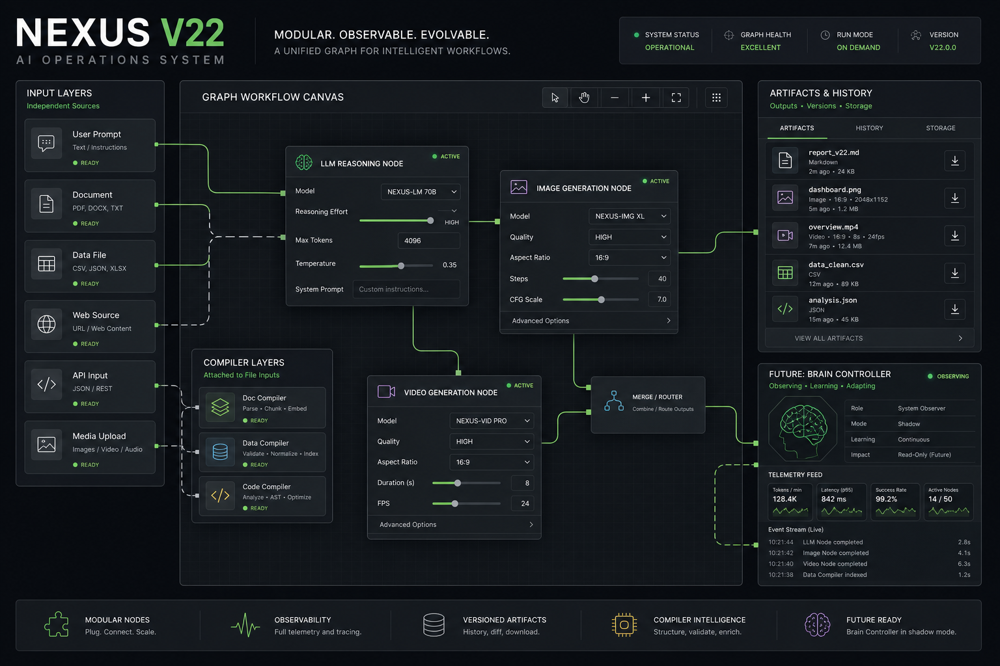

# V22 Workflow Node Upgrade

## Goal

V22 upgrades the graph workspace from a mostly visual workflow surface into a
more practical node workspace:

- Input nodes can start their own workflow path.
- The graph still supports a full `Start All` run.
- LLM nodes expose reasoning controls where the selected model supports them.
- Image model nodes remain connected to artifact persistence and generated
asset download history.
- The system begins to define a JSON workflow format that future LLMs can
generate, import, inspect, and extend.

## Current Architecture Fit

The project already had the right foundation:

- `Workflow Runtime Lite` owns runtime nodes, edges, runs, and context packets.
- `nexus-store` owns workspace state and cloud sync boundaries.
- `nexus-graph` owns the React Flow visual surface.
- `artifact vault` owns generated output history and downloads.
- `nexus-registry` owns model capabilities, including reasoning profiles.

The upgrade therefore extends existing boundaries instead of creating a
parallel workflow engine.

## Implemented Behavior

### Graph Toolbar

- `Start Flow` is now `Start All`.
- Add buttons create nodes at the visible canvas center on click.
- Add buttons can be dragged into the canvas to create nodes at the drop
  position.
- A `Generated` dropdown shows recent generated assets and download actions.

### Input Node

- Input nodes now reserve more editing space.
- Each input node has `Start`, `Pause`, and `Copy`.
- `Start` runs the reachable workflow subgraph beginning at that input.
- `Pause` aborts the active workflow runtime request chain.
- `Copy` copies the node seed text.

### LLM Node

- LLM nodes now expose reasoning effort and detail selectors when supported by
  the model registry.
- Changing the selected model normalizes model settings so stale reasoning
  settings do not survive across incompatible models.

### Generated Assets

- Graph history uses existing artifact vault records.
- It does not create a parallel history store.
- Downloads use the existing artifact download boundary.

## Generated System Map

The system map was generated with `gpt-image-2` through the OpenAI-compatible
`/v1/images/generations` endpoint and saved locally inside this report package.
The companion metadata is available at
`assets/v22-workflow-system-map.metadata.json`.

## Machine Handoff Summary

The companion `machine-manifest.json` defines a workflow format that can be read
by future LLMs. The intended import shape includes:

- `inputs[]`
- `nodes[]`
- `edges[]`
- `outputs[]`
- `compiler`
- `artifactPolicy`
- `telemetry`
- `brain`

This allows a future LLM to answer:

- How many inputs does this workflow have?
- Which LLM nodes exist and which models do they use?
- Which image or video model nodes exist?
- Which nodes compile files or transform payloads?
- Which edges are always-on, conditional, or brain-controlled?
- Which outputs are persisted and downloadable?

## Future Brain / Neural Message Layer

The next architecture step is a graph brain that observes context packets,
node states, run telemetry, artifact creation, and failures.

The brain should receive structured telemetry rather than scraping UI state:

- `ContextPacket`
- `NodeExecution`
- `WorkflowRun`
- `ArtifactVaultRecord`
- `WorkflowRuntimeEdge`
- selected model settings
- compiler metadata

That lets the brain diagnose the current node state, propose routing changes,
or generate workflow JSON without guessing from pixels.

## Verification Plan

Primary verification:

- TypeScript typecheck.
- Focused workflow runtime tests.
- Store tests for explicit node position and input-specific start.
- Source guard tests for composer/history behavior.
- Browser verification for graph UI interactions.
- Production build before commit.

## Verification Results

- Focused tests passed: 4 files, 46 tests.
- TypeScript typecheck passed.
- Production build passed on Next.js 16.2.6.
- Full lint completed with 0 errors; warnings are limited to the existing
  untracked `X/` folder and are not part of this V22 package.
- HTML report smoke passed through a localhost server, including image
  rendering.
- Local graph browser verification is auth-gated by Supabase Auth, so graph
  behavior is covered by focused store/runtime/component tests for this round.
- Chrome plugin verification found Chrome running and native host configured,
  but the Codex Chrome Extension is missing or disabled in the detected
  profile.
- Supabase project status is reachable and healthy through a read-only project
  check.
- Vercel preview deployment is READY on the `v22` branch. The preview is
  protected by Vercel Authentication, so a temporary Vercel share link was used
  for smoke verification without storing the token in the report.

Detailed machine-readable verification data is available in
`verification-summary.json`.

## Self Review

The V22 handoff includes a 3-round architecture Q&A in
`notes/self-review-qna.md`. It focuses on workflow import validation, future
brain-controller telemetry, and media-model expansion without toolbar sprawl.
